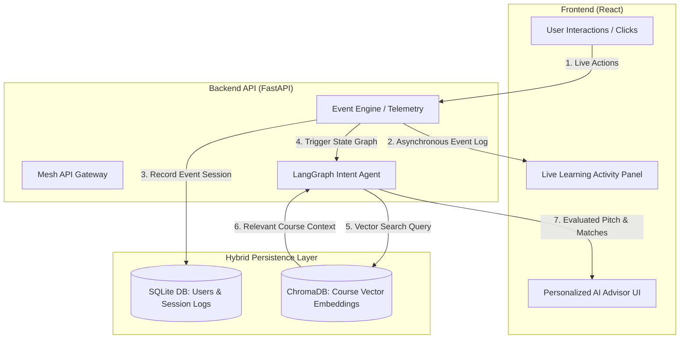

# Aura Academy — Event-Driven AI Learning Marketplace

**SmartReco Build Challenge 2026 Entry**  
An event-driven e-learning platform powered by **Mesh API**, **LangGraph**, and **ChromaDB** that processes real-time user intent to deliver adaptive, dynamic course recommendations.

---

## Problem Statement

Traditional e-learning platforms rely on static course catalogs and pre-computed recommendation models. They fail to capture real-time behavioral signals—such as category navigation, search filters, and cart interactions—resulting in rigid recommendations and lost learner engagement.

---

## Solution Architecture

Aura Academy captures live clickstream events asynchronously without introducing UI latency. These behavioral signals feed directly into a state-graph reasoning agent that continuously re-evaluates learner intent and serves personalized course pitches on the fly.

### System Architecture & Data Flow


 ---

### Block 2: Architectural Highlights, Tech Stack, Installation Setup & Demo Link

```markdown
## Key Architectural Highlights

* **Asynchronous Telemetry:** Non-blocking capture of real-time user behavioral signals into a live observatory stream without main-thread UI latency.
* **LangGraph Orchestration:** Stateful AI reasoning engine executing dynamic intent re-evaluation based on recent activity.
* **Mesh API Integration:** Unified LLM routing powered by Mesh API for resilient prompt execution and pitch generation.
* **Hybrid Storage Architecture:**
  - **SQLite:** Relational database for deterministic user authentication, roles, and event session logging.
  - **ChromaDB:** Vector database for semantic RAG similarity search across course content.

---

## Tech Stack

* **Backend:** Python, FastAPI, Mesh API, LangGraph
* **Databases:** SQLite (Relational State & Logs), ChromaDB (Vector Store)
* **Frontend:** React, TailwindCSS, Lucide Icons, Vite
* **CI & Automation:** GitHub Actions

---

## Getting Started

### Prerequisites
* Python 3.10+
* Node.js 18+

### Setup & Installation

1. **Clone the repository:**
   ```bash
   git clone https://github.com/sajesh-nair/smartreco-agent.git
   cd smartreco-agent
Configure Environment Variables:

Copy .env.example to .env in the root directory and set your Mesh API key:

Bash
cp .env.example .env
Open .env and set:

Code snippet
MESH_API_KEY=your_actual_mesh_api_key
Set up Backend:

Bash
cd backend
python -m venv venv
source venv/bin/activate  # On Windows: venv\Scripts\activate
pip install -r requirements.txt
uvicorn main:app --reload
Set up Frontend:

Bash
cd ../frontend
npm install
npm run dev
Project Demo
YouTube Walkthrough: Aura Academy Demo

http://googleusercontent.com/youtube_content/1
